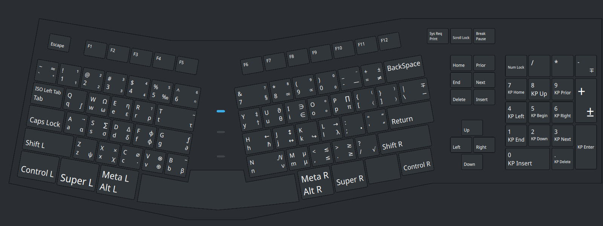
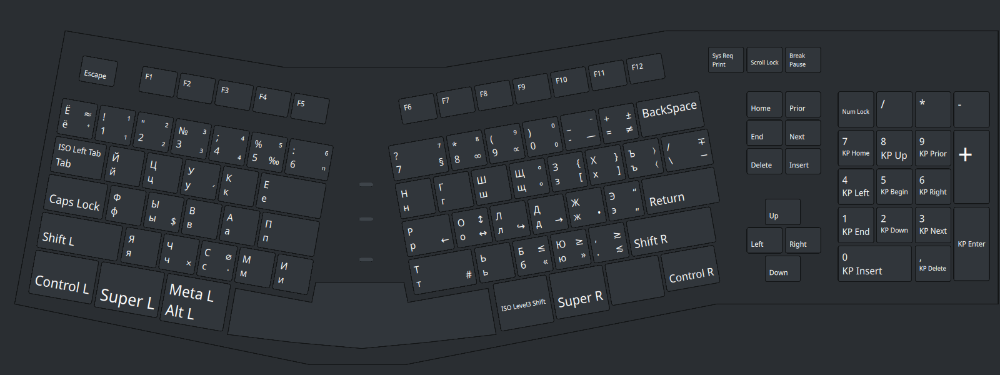

# Math enabled us/ru XKB keyboard layouts

The effect is reached by patching the default system files 
/usr/share/X11/xkb/symbols/us and /usr/share/X11/xkb/symbols/ru.

Commands:
```sh
make show
make view
make us-diff
make ru-diff
make patch
```

## Layouts

### us 



- AltR-Shift-T - combining **t**ilde
- AltR-Shift-B - combining **b**ar (overline)
- AltR-Shift-A - combining right **a**rrow

### ru



- AltR-у - combining acute accent

# See also

[autokey](https://github.com/autokey/autokey) — enter snippets and abbreviations
